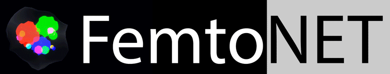
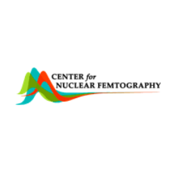
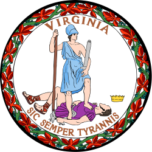

# FemtoNet

This repository contains the open-source releases of the [UVA Center for Femtography](https://pages.shanti.virginia.edu/Femtography/)'s work on the applications of machine learning in the prediction of DVCS observables.

### Overview
Each project is broken down into a subfolder, and *is its own software package*. Please see the README files inside each folder for further instructions.

**1. Unpolarized and Polarized Cross Section Predictions with Deep Learning**

Paper: [Deep Learning Analysis of Deeply Virtual Exclusive Photoproduction](https://arxiv.org/abs/2012.04801)

Code: `dvcs_cross_section`

