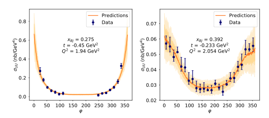
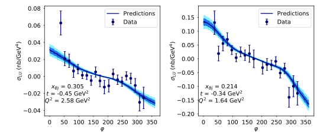
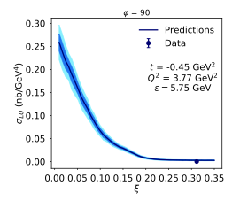

# DVCS_XSX
#### v1.0.0

`dvcs_xsx` is a python library that uses neural networks to predict the unpolarized and polarized cross sections based on experimental DVCS data. 

For an explanation of the motivation and implementation details of this work, please see [our paper](https://arxiv.org/abs/2012.04801).

### Installation
The cleanest way to install FemtoNET is by using a virtual envrionment. If you would prefer to install the package without a virtual environment, you can ignore the sections regarding activating venv and instead run amke user in the dvcs_cross_section/ directory.
```bash
pip install venv
```

#### Windows
```bash
git clone https://github.com/uva-femtography/FemtoNet.git 
cd FemtoNet/dvcs_cross_section/
python -m venv femtonet
cd 
.\femtonet\Scripts\activate.bat
make user
```

#### Linux/Mac OSX
```bash
git clone https://github.com/uva-femtography/FemtoNet.git 
cd FemtoNet/dvcs_cross_section/
python -m venv femtonet
cd 
source \femtonet\Scripts\activate (if using csh, source \femtonet\Scripts\activate.csh instead)
make user
```
To run the code at anytime, simply return to the directory and activate the virtual environment like above.

(If you planning to contribute to `dvcs_xsx` development, or modify its source code, use `make dev` instead)

### Getting Started
`dvcs_xsx` includes the UU and LU pre-trained models that are used in the paper. They can be  used to make predictions without retraining. These are found in `dvcs_xsx/saves/femtonet_UU_standard_0` and `dvcs_xsx/saves/femtonet_LU_standard_01`.

**For all scripts, use the -h flag to get more information about command line arguments**
#### Plotting
##### Cross Section vs. Phi
`python -m dvcs_xsx.plotting.uu_vs_phi`



`python -m nu.plotting.lu_vs_phi`




##### Cross Section vs Xi
`python -m dvcs_xsx.plotting.xsx_vs_xi`



#### Bulk Predictions
##### Predict on Dataset
Use a pretrained model to make predictions on the built-in datasets.

`python -m dvcs_xsx.predict.predict_on_dataset`

##### Predict on CSV
Use a pretrained model to make predictions on your own dataset.

`python -m dvcs_xsx.predict.predict_on_csv`

The column format of the input dataset is expected to be:

xbj | t | Q2 | k0 | phi | xsx type | xsx value | symm err | asymm err down | asymm err up |
--- | --- | --- | --- | --- | --- | --- | --- | --- | --- |
 
where xsx_type is an integer representation of the Cross Section type. Currently, we support:
1. Unpolarized (UU)
2. Polarized (LU)

### Training new Models
You can customize/retrain the model architecture using `python -m dvcs_xsx.train`. The model is small enough to be trained on a CPU, although a GPU would be helpful, especially for hyperparameters sweeps (`python -m dvcs_xsx.arch_search`)

### Troubleshooting
We are working to make this reposity easy to install and reuse in future work. If you encounter issues, or have suggestions for improvement, please open a GitHub issue or pull request.

### Citation
If you use this code in your research, please feel free to cite:

```
@misc{grigsby2020deep,
      title={Deep Learning Analysis of Deeply Virtual Exclusive Photoproduction}, 
      author={Jake Grigsby and Brandon Kriesten and Joshua Hoskins and Simonetta Liuti and Peter Alonzi and Matthias Burkardt},
      year={2020},
      eprint={2012.04801},
      archivePrefix={arXiv},
      primaryClass={hep-ph}
}
```